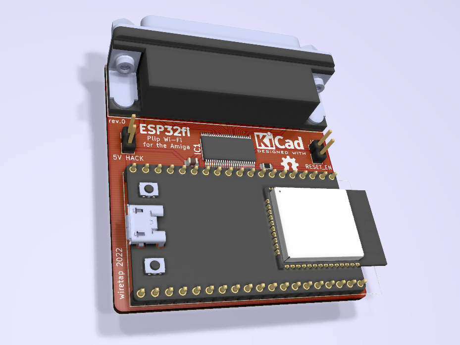

# ESPfi32
A parallel port ESP32 plipbox for the Amiga.

## Info
Do not build. Not tested, firmware and software still pending.

Built for use with the ImpBox32 project: https://github.com/AmigaPorts/ImpBox32
